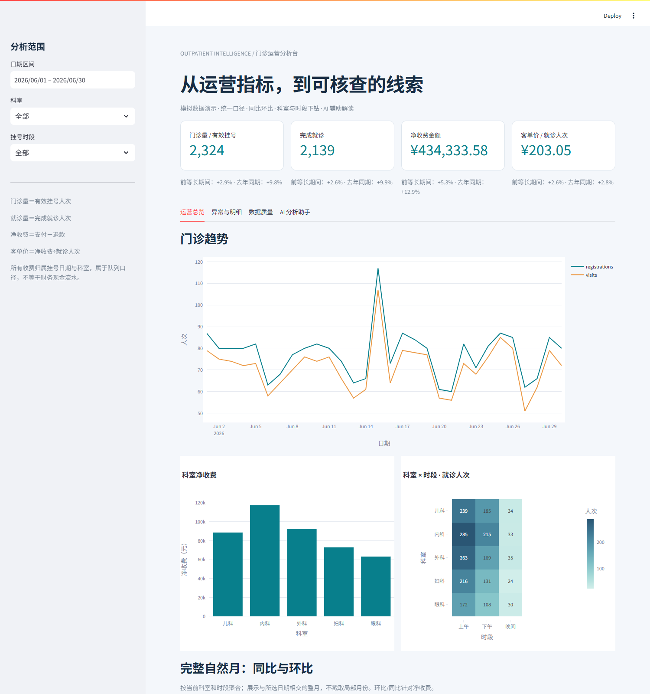
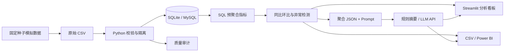

# 医院门诊运营数据分析与 AI 分析助手

基于**可重复生成的模拟数据**，串联“数据校验 → SQL 指标计算 → 异常识别 → 科室/时段/明细下钻 → AI 解读”。面向数据分析作品集与毕业设计扩展演示；没有使用真实患者资料，也不声称已经在医院落地。

技术栈：**Python · SQL · MySQL · Shell/PowerShell · Streamlit · Power BI（M / DAX）· LLM API · Prompt Engineering**。



## 快速运行

推荐 Python 3.12。在项目根目录：

```bash
python -m venv .venv
# Windows
.venv\Scripts\python -m pip install -r requirements.txt
.venv\Scripts\python -m hospital.pipeline --generate
.venv\Scripts\python -m streamlit run app.py --server.address 127.0.0.1
```

打开 **http://127.0.0.1:8501**。Windows 一键流程：`powershell -ExecutionPolicy Bypass -File scripts/run_demo.ps1`；Linux/macOS：`bash scripts/run_demo.sh`。详细环境、MySQL、AI 配置见 [完整复现手册](docs/REPRODUCE.md)。

## 功能

- **统一口径**：有效挂号、完成就诊、支付/退款/净收费、每就诊人次客单价。
- **质量审计**：字段、重复主键、日期、金额、外键校验；错误隔离、来源行号、输入哈希。
- **SQL 计算**：先按挂号聚合多条收费再连接；SQLite 与 MySQL 共用计算 SQL。
- **分析看板**：趋势、完整自然月同比环比、科室排名、时段矩阵、三层业务明细。
- **异常检测**：过去8个同星期日的历史基线，无未来数据泄漏，结果附阈值和样本量。
- **AI 解读**：结构化聚合输入、Prompt 模板、兼容 Chat Completions API；离线规则摘要可直接用。
- **Power BI**：数据导出、Power Query、DAX、主题与建模/下钻步骤；未附已验证的 PBIX。
- **复现与测试**：固定种子、事务重跑、Shell 脚本、Docker Compose、自动测试和 MySQL CI。



## 数据与结果

固定 seed=42，覆盖 **2024-12-01—2026-06-30**，5个科室、3个时段。数据期间用于展示同比，不代表项目开发期间。

| 验证项 | 默认全量结果 |
| --- | ---: |
| 原始挂号行数 / 接收行数 | 44,373 / 44,370 |
| 有效挂号人次 | 41,769 |
| 完成就诊人次 | 38,446 |
| 净收费金额（元） | 7,692,787.92 |
| 每就诊人次客单价（元） | 200.09 |
| 隔离记录 | 6 |
| 日×科室×时段指标行数 | 8,655 |

两项注入异常：2026-06-15 儿科量增、2026-06-22 内科收费增。检测还会产生其他统计异常，不等于已证实业务问题。[指标字典与边界](docs/METRICS.md)解释退款、零分母、历史不足和异常误报。

## 项目目录

```text
app.py                  # 交互式运营看板
hospital/               # 生成、清洗、数据库、分析、AI、管道
sql/                    # 两种数据库共用的建表与指标 SQL
prompts/                # 运营解读模板
powerbi/                # Power Query、DAX、主题、复现说明
scripts/                # Windows / Linux / Docker 运行入口
tests/                  # 业务口径、质量、API契约、看板与数据库一致性
docs/                   # 完整流程、指标定义与验收记录
data/                   # 运行生成，Git忽略
artifacts/              # 指标、明细、审计和报告，运行生成
```

## 验证

```bash
python -m pytest -q
```

测试覆盖收费连接不重复计数、退款净额、质量守恒、冲突主键、多就诊、重跑一致性、完整月比较、无未来泄漏、事务回滚、AI输入与请求契约、页面筛选与规则摘要。`TEST_MYSQL=1` 时额外验证 MySQL；GitHub Actions 还执行全量双后端输出比对。

实际执行结果与未验证范围记录在 [验收记录](docs/VALIDATION.md)。**真实 LLM 调用需要自行配置；Power BI Desktop 需要按文档导入。**

## 项目展示表述

可描述为“医院门诊运营数据分析与 AI 分析助手（模拟数据项目）”：梳理挂号、就诊、收费三类业务实体，构建可复现清洗与指标管道，实现趋势、同比环比、异常检测和明细核查，提供结构化 Prompt 与 Power BI 接入方案。请按实际开发时间及个人工作填写经历，不把模拟结果写成真实医院业绩。
